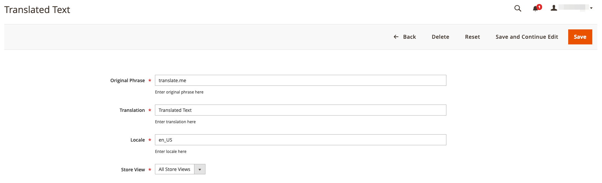

E-CONOMIX Database Translation Magento2 Module
============
 
 
 
 
Magento2 module to add and edit database translation within the backend.

Installation
------------

The easiest way to install the extension is to use [Composer](https://getcomposer.org/).

Run the following commands:

- ```$ composer require e-conomix/module-dbtranslations```
- ```$ bin/magento module:enable Economix_DbTranslations```
- ```$ bin/magento setup:upgrade && bin/magento setup:static-content:deploy```

Attention
-----------
:exclamation: These translations should not be used if not absolutely necessary! Create translations within module, language pack or theme instead. :exclamation:

Features
------------

Create and edit existing database translations from the backend, go to:

    Content -> Translations -> DB Translations
    


*List view*


*Edit view*


*Create view*
